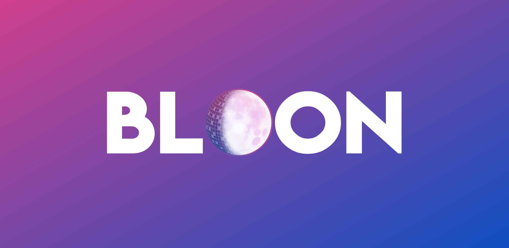
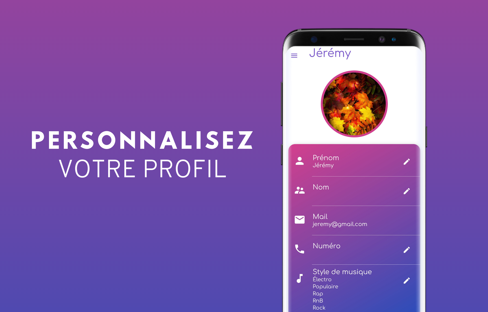
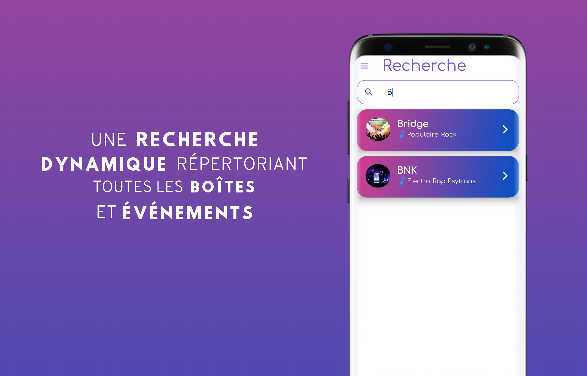
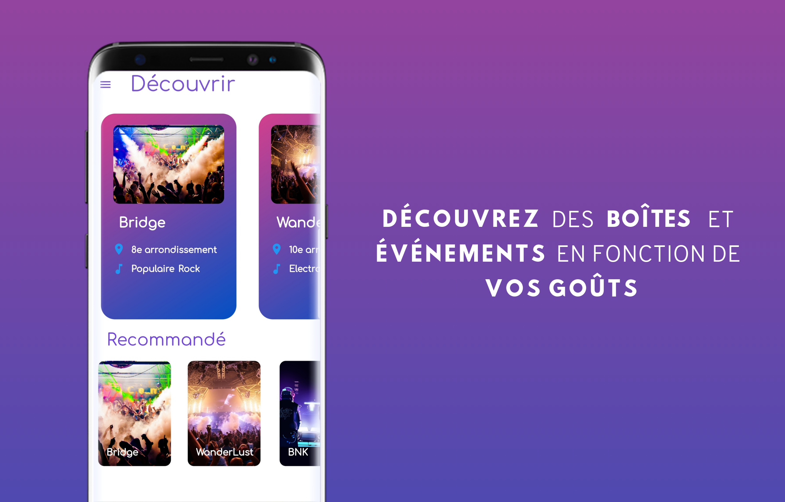
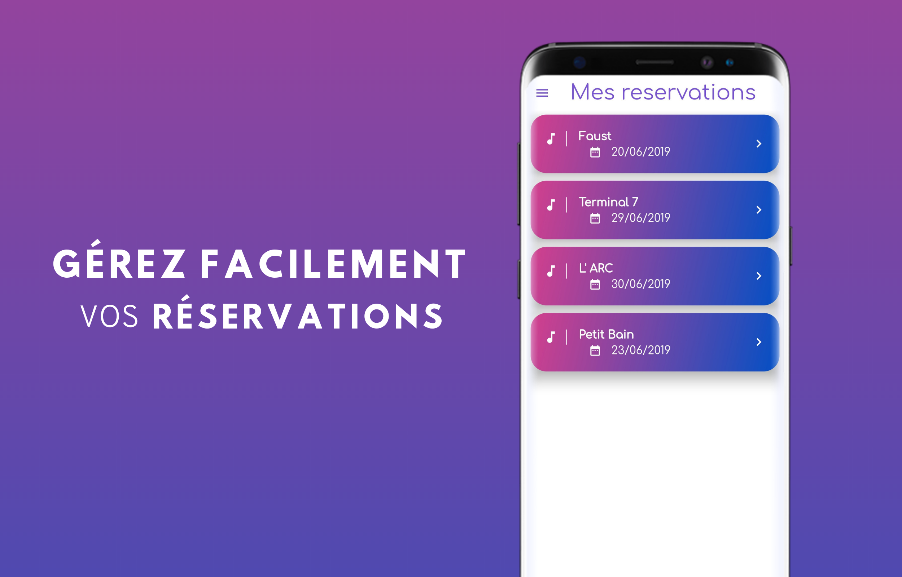
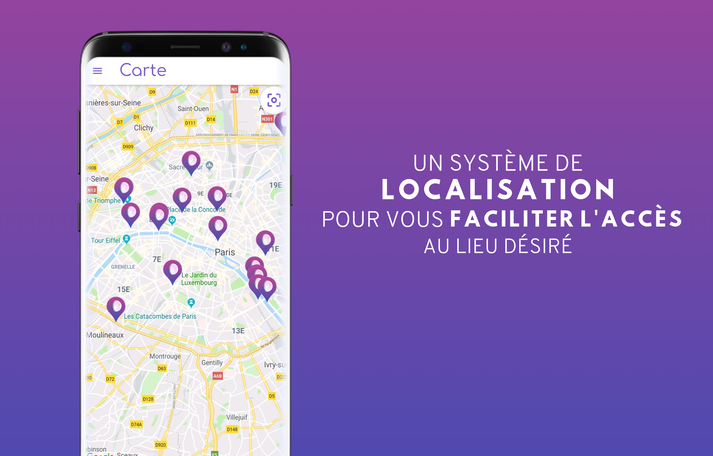
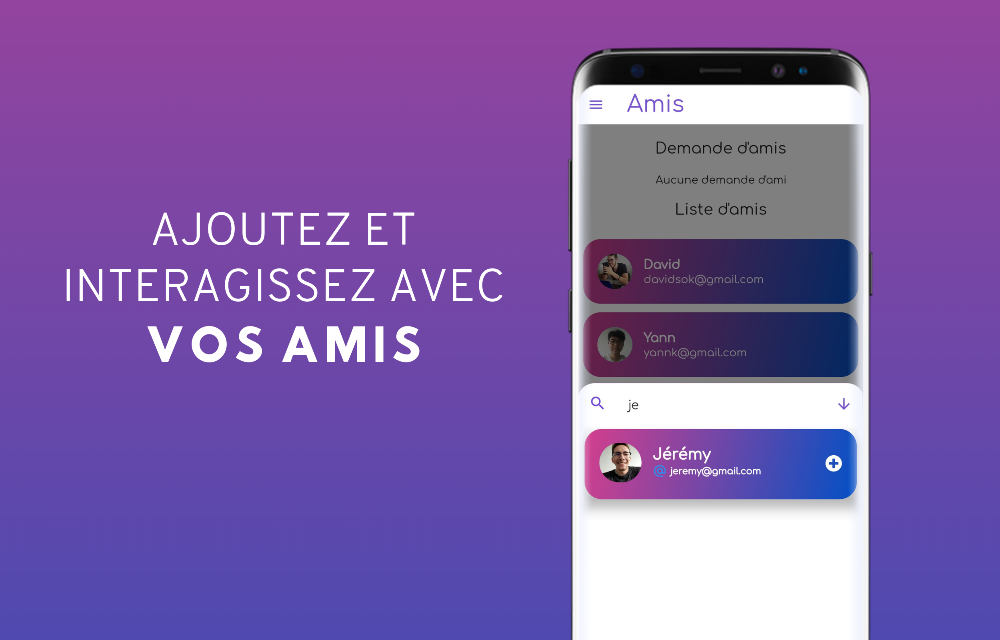
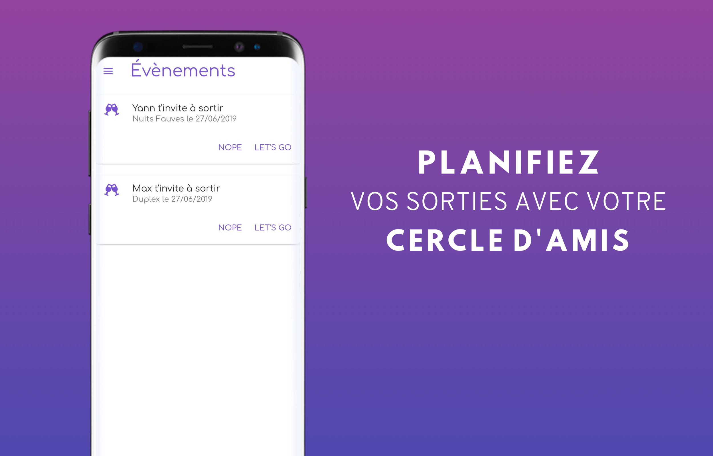

# Bloon

Bloon is mobile application for E3 project in ESIEE Paris. He list all night clubs and events in Paris and recommend you 
according to you personnalized profile. Bloon organize your party into one click.

## Features

__Profile :__

When you create a new account, you can personalize your profile with a new image from your gallery or you can use the camera from your phone to take a picture of you instant.
You can also change the music according the mood you are in, and our algorithm is going to suggest you the best nightClub according to your music style.

__Research :__

On this page you can research your favorite nightClub with his name.

__Discover :__

The discovery page is the first one you are going to see when you first launched the application, on this page you will see on the top 5 club who are randomly picked from our database.
On the bottom of the screen you can find the club we suggest you according to the music style you select in your profile.

__Favorite :__

When you go on a nightClub Page you have the possibility to put in favorites the club, when you do that it will show on your favorite page.

__Reservation :__

When you book a place for a club in particular it will generate a QR Code with your name, the date and the club and when you will go on the reservation page you
will see all your reservation and when you will be in front of the bailer of the club you will show your QR code to him and he will scan it and you will be able to go in !

__QR Code :__

Once you have made a reservation you will see it on the reservation page. Next if you click on it you will see a new page with a QR code on it. 
When you go to the club you will have to show this Qr code to the bailer and he will scan it and let you go through.

__Map :__

If you want to search for the closest nightClub from you, go on the map and you will see all the club from our database.
And if you want to go to your club from your destination we will suggest you different way to move : uber, map,...

__Friends :__

You can add your friends on the app and this will allow you to invite them to a nightClub when you will go out.

__Event:__

Once you have some friends in your account you can invite them to a club or an event. When you do that a notification will be send to him and he can go to the 
event screen to accept or deny the invitation.

## Getting Started

This project is a starting point for a Flutter application.

A few resources to get you started if this is your first Flutter project:

- [Lab: Write your first Flutter app](https://flutter.io/docs/get-started/codelab)
- [Cookbook: Useful Flutter samples](https://flutter.io/docs/cookbook)

For help getting started with Flutter, view our 
[online documentation](https://flutter.io/docs), which offers tutorials, 
samples, guidance on mobile development, and a full API reference.

## Features

Profile
Lors de la création de votre compte, votre profile est personnalisé et permet à Bloon de vous recommander les événements qui correspondent le plus à vos goûts musicaux.

Research
Un onglet recherche vous permet de trier les boîtes de nuit selon les noms.

Discover
La page de découverte sélectionne 5 boîtes de nuits au hasard parmis les disponibilités dans la base de données et affiche cette dernière avec une location peu précise.

Recommendation
Les boîtes de nuit et les événements sont personnalisé selon votre profil personnalisé

Favoris
Des coeurs en haut à droite de chaque page des boîtes de nuit permet d'ajouter dans l'onglet favoris la boîte de nuit 

Réservations
Les bôites de nuit réserver sont sauvegardés dans un onglet réservation

Carte
Une carte est disponible afin de cartographié les boîtes de nuit.

Amis
Vous pouvez ajouter des amis dans une liste d'amis pour envoyer des invitations de vos événements préférés.

Invitation
Les invations de vous recevez de vos amis sont générer dans un onglet